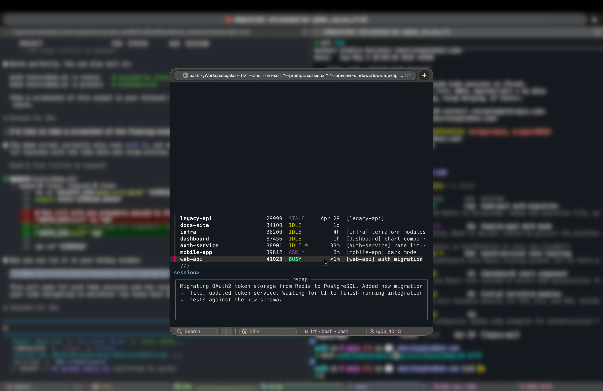

# cctl — Claude Code Control

A CLI for managing concurrent Claude Code sessions in iTerm2.

- See all sessions at a glance: **BUSY**, **ASK** (waiting for input), **IDLE**, **STALE**
- Switch between sessions with a fuzzy picker or by PID/project name
- View recaps of what each session is working on
- Get notified when sessions need your attention (`*` marker)



## Prerequisites

- **macOS** (AppleScript is used for iTerm2 window switching)
- **iTerm2** — [iterm2.com](https://iterm2.com)
- **Go 1.21+** — for building the data layer binary
- **Homebrew** — for installing jq and fzf

## Setup

### 1. Install dependencies

```bash
brew install jq fzf
```

`jq` is required. `fzf` is optional — without it, `cctl` falls back to a plain list instead of the interactive picker.

### 2. Clone and build

```bash
git clone https://github.com/akurinnoy/cctl.git
cd cctl
make install
```

This builds the Go binary and copies both `cctl` and `cctl-data` to `~/.local/bin/`.

To install somewhere else:

```bash
make install PREFIX=~/bin
```

### 3. Add to PATH

Make sure the install directory is in your `PATH`. Add one of these to your shell config:

**bash** (`~/.bashrc`):
```bash
export PATH="$HOME/.local/bin:$PATH"
```

**zsh** (`~/.zshrc`):
```bash
export PATH="$HOME/.local/bin:$PATH"
```

**fish** (`~/.config/fish/config.fish`):
```fish
fish_add_path ~/.local/bin
```

### 4. Set up iTerm2 Hotkey Window

`cctl` works best with a dedicated iTerm2 hotkey window — press a key, the session picker appears instantly, pick a session, and you land in the right window.

**Create the profile:**

1. Open **iTerm2** → **Settings** → **Profiles**
2. Click **+** to create a new profile (e.g., "cctl")

**Configure the profile (General tab):**

3. **Command**: keep it on **Login Shell** (do not use "Custom Shell" — it expects a binary path, not a command)
4. **Send text at start**: enter `cctl\n`

This opens a normal shell and immediately runs `cctl`. You also get a live shell underneath if you dismiss the picker.

**Configure the hotkey (Keys tab):**

5. Click **Configure Hotkey Window**
6. Check **A hotkey opens a dedicated window with this profile**
7. Click **Set Hotkey** and assign a keyboard shortcut (e.g., `⌃\` or `⌥Space`)
8. Check **Floating window** — so the picker appears over other apps
9. **Uncheck "Automatically reopen on app activation"** — this is critical, otherwise the hotkey window reappears after `cctl` switches to another session

**How it works end-to-end:**
1. Press your hotkey → floating terminal appears with the session picker already running
2. Pick a session with arrow keys + Enter
3. `cctl` switches to that session's iTerm2 window and auto-closes the hotkey window

### 5. Verify installation

```bash
cctl ls
```

You should see a formatted list of all your active Claude Code sessions.

## Usage

```bash
cctl                        # interactive picker (fzf)
cctl ls                     # list all sessions
cctl ls -s status           # sort by status (BUSY → ASK → IDLE → STALE)
cctl ls -s project          # sort by project name
cctl ls -s age              # sort by last activity (default)
cctl pick                   # explicit interactive picker
cctl switch 29125           # switch to session by PID
cctl switch che-dashboard   # switch to session by project name
cctl recap 29125            # show full recap for a session
```

### Status labels

| Label | Meaning |
|-------|---------|
| **BUSY** | Agent is actively working |
| **ASK** | Agent is waiting for your input |
| **IDLE** | Agent finished, sitting idle |
| **STALE** | Session process is no longer running |

### Attention marker (`*`)

Sessions that need your attention show a `*` after the status label (e.g., `IDLE *`, `ASK *`). This means the session changed since you last looked at it.

The marker clears when you:
- Switch to the session via `cctl switch` or the picker
- The session goes back to BUSY (you're actively working in it)

### Interactive picker

Running `cctl` with no arguments opens the fzf picker. Use arrow keys to navigate, Enter to switch. The right panel shows a recap of what each session is working on.

### Piped output

When piped, `cctl` strips ANSI colors automatically:

```bash
cctl ls | grep IDLE
cctl ls -s status | head -20
```

## How it works

`cctl` is two components:

- **`cctl`** (bash) — ANSI formatting, fzf picker, sorting, AppleScript window switching
- **`cctl-data`** (Go) — reads Claude Code's data files, merges recaps from multiple sources, outputs JSON to stdout

The Go binary reads from these locations:

| Source | Path | What it provides |
|--------|------|------------------|
| Session files | `~/.claude/sessions/*.json` | PID, status, cwd, timestamps |
| Conversation logs | `~/.claude/projects/<key>/<sessionId>.jsonl` | `away_summary` recaps |
| Remember plugin | `<project>/.remember/now.md` | Live session notes (optional) |

When multiple recap sources exist, the one with the **freshest file mtime** wins.

### Data sources

`cctl` works out of the box with just Claude Code installed. It reads the native session files (`~/.claude/sessions/`) and conversation logs (`~/.claude/projects/`) — no plugins required.

If a project has a `.remember/` directory (from the [remember](https://github.com/anthropics/claude-code-remember) plugin), `cctl` will also pick up live session notes from there and use whichever source is freshest.

## Troubleshooting

### `cctl switch` does nothing

- Make sure iTerm2 is running (not just Terminal.app)
- Verify the PID is still alive: `ps -p <PID>`
- Check that you're running inside iTerm2 (`echo $TERM_PROGRAM` should show `iTerm.app`)

### "No active sessions"

- Claude Code sessions must be running in iTerm2
- Check that `~/.claude/sessions/` contains `.json` files
- Sessions with dead processes are filtered out

### Hotkey window reappears after switching

In iTerm2 Settings → Profiles → your hotkey profile → Keys → Configure Hotkey Window, make sure **"Automatically reopen on app activation"** is **unchecked**. This setting causes the hotkey window to reappear whenever iTerm2 is activated (which happens when `cctl` switches to another window).

### fzf not found

```bash
brew install fzf
```

Without fzf, `cctl` falls back to `cctl ls` automatically.

## Development

```bash
# Run Go tests
make test

# Build without installing
make build

# Check dependencies
make check

# Clean build artifacts
make clean
```

## Dependencies

| Dependency | Required | Purpose |
|------------|----------|---------|
| macOS | Yes | AppleScript for window switching |
| iTerm2 | Yes | Terminal with scriptable session control |
| Go 1.21+ | Build only | Compiling `cctl-data` |
| jq | Yes | JSON processing in the bash wrapper |
| fzf | No | Interactive picker (falls back to plain list) |
